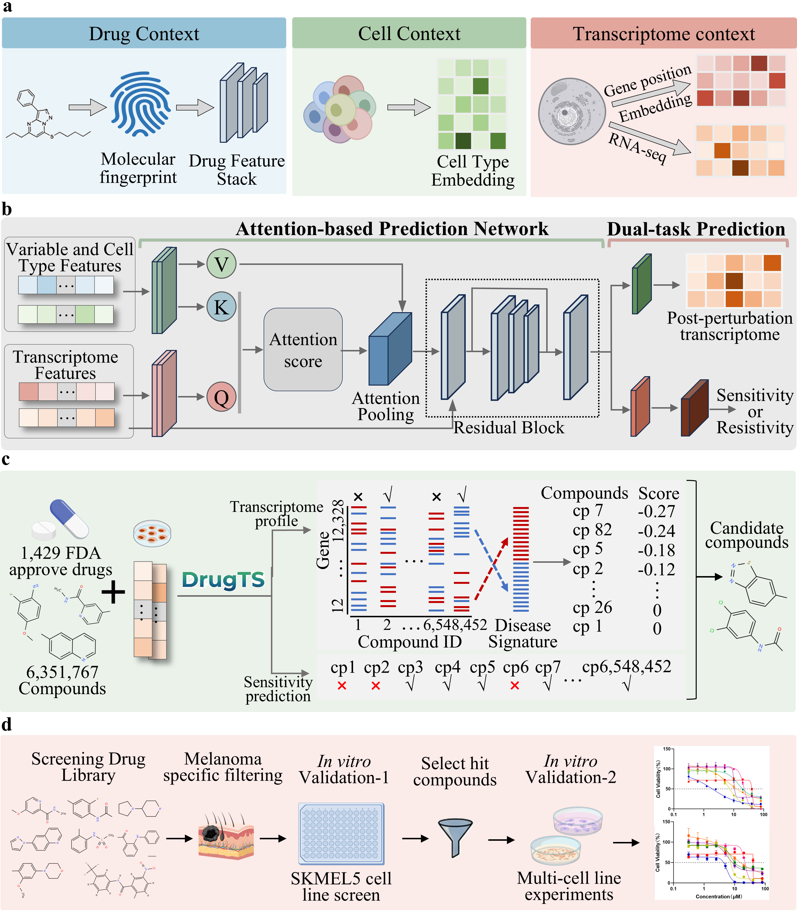

# DrugTS —— Advancing drug discovery through Joint Prediction of Drug Perturbation Transcriptome and Sensitivity

<H3>Overview</H3>
<p align="center">
  
</p>


Using the DrugTS API, users can reproduce the results reported in our paper and train DrugTS on their own perturbation datasets with only a few lines of code.

DrugTS provides three main functions:

1. **Transcriptome Prediction**
2. **Drug Sensitivity Prediction**
3. **Drug Recommendation**

---

## 1. Transcriptome Prediction

DrugTS predicts the post-perturbation transcriptome profile based on the input drug SMILES and cell line context.

### Training

```python
from PertDataProcess import *
from train_transcript import *


# Load perturbation dataset
pert_data = PertData('../data/data_example')
# Specify dataset
pert_data.load(data_name='transcript')
# Prepare data split
# Available options: random, random_no_test, drug, drug_no_test
pert_data.prepare_split(task='transcriptome', split='drug', seed=1)
# Generate dataloader
pert_data.get_dataloader(batch_size=64, test_batch_size=64)

# Initialize Cross-attention model
model = Drug(pert_data, device='cuda:0')
model.model_initialize()
# Train model
model.train(epochs=10, lr=0.001)
```

### Load Pre-trained Model

```python
model.load_pretrained(path='trans_models/seed1/ca_model_lr0.001.pth')
```

### Transcriptome Prediction

Prepare drug information in a CSV file containing drug names and SMILES:
Example:
```
FDA.csv
Name,SMILES
Drug_A,CC(C)...
Drug_B,C1=CC=...
```

Run prediction:

```python
import pandas as pd


# Read molecules
csv_file = 'FDA.csv'
drug_inf = pd.read_csv(csv_file)
drug_name = drug_inf['Name']
smiles = drug_inf['SMILES']
# Cell line
# Must be included in the training dataset
cell_type = 'A375'
# Output file
w_file = 'predict_a375_trans.h5ad'


# Predict post-perturbation transcriptome
model.predict(drug_name, smiles, cell_type, w_file)
```

The output file (`*.h5ad`) contains the predicted post-perturbation gene expression profiles.

---

# 2. Drug Sensitivity Prediction

DrugTS can also predict drug sensitivity based on drug chemical information and cellular context.

## Training

```python
from PertDataProcess import *
from train_sensitivte import *


# Load dataset
pert_data = PertData('../data/data_example')
# Load sensitivity dataset
pert_data.load(data_name='sensitivte')
# Prepare split
pert_data.prepare_split(task='sensitivte', split='drug', seed=1)
# Generate dataloader
pert_data.get_dataloader(batch_size=64, test_batch_size=64)

# Initialize model
model = Drug(pert_data, device='cuda:0')
model.model_initialize()
# Train
model.train(epochs=10,lr=0.001)
```

---

## Load Pre-trained Sensitivity Model

```python
model.load_pretrained(path='melanoma/models/seed1/ca_model.pth')
```

---

## Predict Drug Sensitivity

```python
import pandas as pd


# Read drug information
csv_file = 'FDA.csv'
drug_inf = pd.read_csv(csv_file)
drug_name = drug_inf['Name']
smiles = drug_inf['SMILES']
# Cell line
cell_type = 'A375'
# Output file
w_file = 'predict_a375_sensi.csv'

# Predict sensitivity
model.predict(drug_name, smiles, cell_type,w_file)
```

The output CSV file contains the predicted drug sensitivity scores.

---

# 3. Drug Recommendation

Drug recommendation is performed by integrating:

1. Transcriptome reversal score
2. Drug sensitivity prediction


## Step 1: Calculate Transcriptome Reversal Score

First, calculate the predicted differential expression:

$$
\log_2FC = \log_2\left(\frac{Expression_{predicted\ perturbation}}{Expression_{control}}\right)
$$

The predicted log2FC matrix should be saved as:

```
a375_log2fc.csv
```

Then run:

```bash
python drug_recommend/reverse_score.py \
    a375_log2fc.csv \
    drug_recommend/melanoma_disease_up_genes.txt \
    melanoma_disease_down_genes.txt \
    reverse_score.csv
```

The output file:

```
reverse_score.csv
```

contains the transcriptional reversal scores of candidate drugs.

---

## Step 2: Filter Candidate Drugs

Sort drugs according to the reversal score:

```
Lower reversal score = stronger disease reversal effect
```

Then integrate with drug sensitivity prediction:

- Remove drugs predicted to have resistance
- Prioritize drugs with:
    - Strong transcriptome reversal ability
    - High predicted sensitivity


The final ranked list represents the recommended therapeutic candidates.


# Citation

If you use DrugTS in your research, please cite:

```
paper 
```
